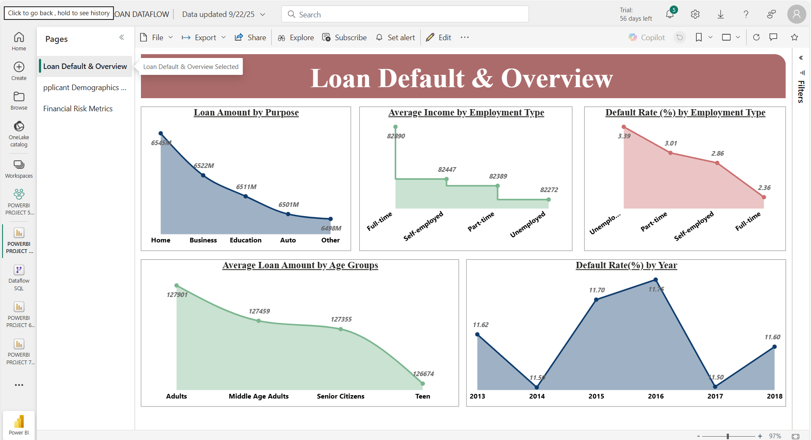

# Loan Default Risk Dashboard (Datasource: Power BI Dataflow – SQL Server)

### Dashboard Link : https://app.powerbi.com/reportEmbed?reportId=64d5df37-1c33-453c-a63c-df9659044135&autoAuth=true&ctid=4190cc35-fd93-4aa6-9817-c1121132f7e2

## Problem Statement

This dashboard provides an analysis of loan default risk, enabling financial institutions to monitor key KPIs such as default rates, loan amounts, credit score distributions, and borrower demographics.

Through the visuals, users can explore borrower characteristics (age, income, marital status, dependents), financial indicators (mortgage status, employment type), and loan details (purpose, loan amount). Metrics like Year-on-Year loan amount changes, Year-to-Date loan volumes, and default rates by credit score or employment type highlight areas of risk and opportunity.

The report helps identify high-risk borrower groups, assess repayment behavior, and monitor loan performance across demographic and financial categories. Data is managed through Power BI Dataflows and SQL Server, ensuring secure connectivity, consistency, and automatic refresh.

Overall, the dashboard supports data-driven credit risk assessment, enabling lenders to improve lending strategies, reduce defaults, and safeguard profitability.

### Steps followed 

- Step 1 : The loan dataset was first loaded into SQL Server and then integrated into Power BI using a centrally managed Power BI Dataflow for consistency and refresh management. This ensured secure and centralized data connectivity via the Power BI Gateway. Initial data profiling was carried out in Power Query Editor, where column data types were validated and missing or erroneous values were corrected.
- Step 2 : Data modeling was performed by creating calculated columns such as Year, Age Groups, Credit Score Bins, and Income Brackets. These categorizations allowed continuous variables to be grouped meaningfully for visualization and analysis.


```DAX
  Age Group = 
IF('Loan_default'[Age] <= 19 , "Teen",
   IF('Loan_default'[Age] <= 39, "Adults",
        IF('Loan_default'[Age]<= 59, "Middle Age Adults",
        "Senior Citizens")))
  ```
  ```DAX
  Credit Score Bins = 
IF ('Loan_default'[CreditScore] <= 400, "Very Low",
    IF('Loan_default'[CreditScore] <= 450, "Low",
        IF('Loan_default'[CreditScore] <= 650, "Medium",
        "High")))
  ```
  ```DAX
  Income Bracket = 
SWITCH(
    TRUE(),
    'Loan_default'[Income] <30000, "Low Income",
    'Loan_default'[Income] >= 30000 && 'Loan_default'[Income] <60000, "Medium Income",
    'Loan_default'[Income] >= 60000, "High Income"
)
  ```
- Step 3 : A dedicated Measures Table was created in Power BI to centralize all DAX calculations. Key measures were defined for default rate, loan amounts, and income-based aggregations. These included:
**Default Rate by Year**
 ```DAX
Default Rate by Year = 
Var totalloans = CALCULATE(COUNTROWS('Loan_default'), ALLEXCEPT('Loan_default', 'Loan_default'[Year]))

Var default= CALCULATE(COUNTROWS(FILTER('Loan_default', 'Loan_default'[Default]= TRUE())),
 ALLEXCEPT('Loan_default', 'Loan_default'[Year]))

 RETURN 
 DIVIDE(default, totalloans) * 100
 ```
 **Default rate by Employment Type**
 ```DAX
Default rate by Employment Type = 
Var totalrecords = COUNTROWS(ALL('Loan_default'))
Var DefaultCases = COUNTROWS(FILTER('Loan_default', 'Loan_default'[Default] = TRUE()))

RETURN
CALCULATE(DIVIDE(DefaultCases, totalrecords), ALLEXCEPT('Loan_default', 'Loan_default'[EmploymentType])) * 100
 ```
 **Total Loan Amount (Credit Bins)**
 ```DAX
Total Loan Amount (Credit Bins) = 
CALCULATE(SUM('Loan_default'[LoanAmount]), 'Loan_default'[Age Group]= "Adults", 
ALLEXCEPT('Loan_default', 'Loan_default'[Age Group],'Loan_default'[Age], 'Loan_default'[Credit Score Bins], 'Loan_default'[CreditScore]))
 ```
  **YOY Default Loans Change**
 ```DAX
YOY Default Loans Change = 
DIVIDE(
    CALCULATE(COUNTROWS(FILTER('Loan_default', 'Loan_default'[Default]= TRUE())), 'Loan_default'[Year]= YEAR(MAX('Loan_default'[Loan_Date_MM_DD_YYYY]))) - CALCULATE(COUNTROWS(FILTER('Loan_default', 'Loan_default'[Default]= TRUE())), 'Loan_default'[Year] = YEAR(MAX('Loan_default'[Loan_Date_MM_DD_YYYY]))-1)

    , CALCULATE(COUNTROWS(FILTER('Loan_default', 'Loan_default'[Default]= TRUE())), 'Loan_default'[Year] = YEAR(MAX('Loan_default'[Loan_Date_MM_DD_YYYY]))-1), 0) * 100
 ```
 **YOY Loan Amount Change**
 ```DAX
YOY Loan Amount Change = 
DIVIDE(
    CALCULATE(SUM('Loan_default'[LoanAmount]), 'Loan_default'[Year] = YEAR(MAX('Loan_default'[Loan_Date_MM_DD_YYYY]))) - 
    CALCULATE(SUM('Loan_default'[LoanAmount]), 'Loan_default'[Year] = YEAR(MAX('Loan_default'[Loan_Date_MM_DD_YYYY])) - 1)

    , CALCULATE(SUM('Loan_default'[LoanAmount]), 'Loan_default'[Year] = YEAR(MAX('Loan_default'[Loan_Date_MM_DD_YYYY])) - 1), 0) * 100
 ```
 **YOY Default Loans Change**
 ```DAX
YOY Default Loans Change = 
DIVIDE(CALCULATE(COUNTROWS(FILTER('Loan_default', 'Loan_default'[Default]= TRUE())), 'Loan_default'[Year]= 
YEAR(MAX('Loan_default'[Loan_Date_MM_DD_YYYY]))) - 
    CALCULATE(COUNTROWS(FILTER('Loan_default', 
    'Loan_default'[Default]= TRUE())), 'Loan_default'[Year] = YEAR(MAX('Loan_default'[Loan_Date_MM_DD_YYYY]))-1)

    , CALCULATE(COUNTROWS(FILTER('Loan_default', 'Loan_default'[Default]= TRUE())), 'Loan_default'[Year] = YEAR(MAX('Loan_default'[Loan_Date_MM_DD_YYYY]))-1), 0) * 100
 ```
- Step 4 : Loan Default & Overview, multiple visuals were designed to provide a consolidated snapshot of loan distribution, repayment behavior, and default risks.

  The Loan Amount by Purpose line chart illustrates how loan amounts vary across different purposes such as Home, Business, Education, Auto, and Others. This chart helps identify which loan categories dominate overall lending and where the largest financial exposure lies.

  The Average Income by Employment Type line chart shows the income levels of applicants segmented by Full-time, Self-employed, Part-time, and Unemployed groups. This was included to highlight how income levels differ by employment type and to provide context when analyzing repayment capacity and default risks.

  The Default Rate (%) by Employment Type line chart depicts the percentage of loan defaults across employment categories. This chart is critical for risk assessment, as it shows that unemployed applicants have the highest likelihood of default, while full-time employees demonstrate lower risk.

  The Average Loan Amount by Age Groups chart compares borrowing behavior across Teens, Adults, Middle Age Adults, and Senior Citizens. This visualization helps determine which age segments borrow higher amounts and highlights potential risk exposure in different demographic groups.

  The Default Rate (%) by Year chart tracks how default rates have evolved over time from 2013 to 2018. By visualizing trends year over year, this chart provides insights into whether default risk is increasing or decreasing, which is essential for long-term credit risk management and policy decisions.

- Step5 : On Page 2 – Applicant Demographics and Financial Profile, visuals were designed to analyze the relationship between applicant characteristics, financial background, and loan amounts.

  The Median Loan Amount by Credit Score Bins chart highlights how loan amounts vary across applicants with Low, Medium, Very Low, and High credit scores. This helps in assessing whether higher credit scores lead to larger or smaller borrowing amounts and provides an indication of how lenders allocate credit risk.

  The Average Loan Amount (High Credit) by Age Group and Marital Status donut chart segments high-credit applicants by their age group and marital status. This chart was created to understand how different life stages and marital conditions influence borrowing, revealing which demographic segments contribute most to high-credit borrowing.

  The Total Loan Amount (Adults) by Credit Score Bins chart focuses specifically on adult applicants, showing how much loan volume they contribute under different credit score categories. This adds granularity to the broader credit score analysis by isolating adults as the key borrowing group.

  The Total Loan Amount (Middle Age Adults) by Dependents/Mortgage bar chart compares borrowing patterns between applicants who have dependents or mortgages versus those who do not. This helps evaluate whether financial responsibilities like dependents and mortgages increase or decrease borrowing capacity.

  The Number of Loans (Education Type) chart displays loan distribution across applicants with different education levels such as Bachelor’s, High School, Master’s, and PhD. This was included to explore whether education background correlates with borrowing frequency, showing the segments most reliant on loans.

- Step 6 : On Page 3 – Financial Risk Metrics, the visuals were designed to evaluate credit risk, default behavior, and financial distribution patterns, enabling stakeholders to identify potential risk factors in lending.

  The YOY Loan Amount Change by Year line chart tracks the year-over-year change in total loan amounts from 2013 to 2018. This visual was included to highlight trends in lending growth and contraction, showing periods of expansion such as 2015 and 2018 versus declines in 2014 and 2017. It provides context for how loan disbursement has evolved over time.

  The YOY Default Loans Change line chart displays year-over-year changes in loan defaults. By comparing peaks such as 2015 and troughs like 2017, stakeholders can better understand fluctuations in default risk and assess whether risk management measures align with lending activity.

  The YTD Loan Amount by Credit Score Bins and Marital Status Sankey-style chart shows how loan amounts are distributed across credit score bins (Medium, High, Very Low, Low) and further segmented by marital status (Divorced, Married, Single). This chart was included to illustrate how both creditworthiness and personal demographics jointly influence loan allocation, helping assess which borrower profiles carry higher risk exposure.

  The Loan Amount Distribution by Income Bracket and Employment Type flow chart presents how total loan amounts (32.58bn) break down across high, medium, and low income levels and are further distributed among employment types (Unemployed, Part-time, Self-employed). This visual helps in evaluating whether loans are concentrated among high-income, stable employment groups or spread across riskier categories, thus providing insights into portfolio stability.
- Step 7 : The finalized report was published to Power BI Service under the Loan Default Risk Project workspace. Data refresh schedules were configured, ensuring that loan performance and risk metrics stayed up to date. The deployment also included refresh monitoring and failure notifications.


# Snapshot of Dashboard (Power BI Service)

 



 

## Insights  

A three-page report was created in Power BI Desktop and then published to Power BI Service. The dashboard focused on analyzing loan allocation, default behavior, applicant demographics, and financial risk metrics to provide a holistic view of lending performance.  

### 1. Loan Default & Overview (Page 1)  
The **Loan Amount by Purpose** chart revealed that home loans accounted for the highest amount at **6545M**, followed by business and education loans, while auto and other loans represented lower allocations. This indicates that housing continues to dominate loan portfolios.  

The **Average Income by Employment Type** visual showed that full-time employees earned the highest income at **82,890**, while unemployed applicants had the lowest at **82,272**. This highlights the income disparity across applicant groups.  

The **Default Rate by Employment Type** chart demonstrated that unemployed applicants had the highest default rate at **3.39%**, while full-time employees had the lowest at **2.36%**. This suggests that employment stability is a strong predictor of repayment reliability.  

The **Average Loan Amount by Age Group** showed that adults and middle-aged applicants secured the highest loan amounts at around **127K**, while teens received significantly lower amounts at **126K**, reflecting cautious lending practices for younger applicants.  

The **Default Rate by Year** trend revealed fluctuations, peaking at **11.75% in 2016** before dropping sharply in **2017 & 2014 (11.50%)** and then rising again in **2018 (11.60%)**. This suggests that external economic conditions strongly influence loan default behavior.  

## 2. Applicant Demographics and Financial Profile (Page 2)  
The **Median Loan Amount by Credit Score Bins** chart indicated that applicants with low credit scores received the highest median loan amount at **128K**, while high credit score applicants averaged lower at **127K**. This counterintuitive finding suggests higher-risk segments are still being approved with large amounts, raising potential concerns.  

The **Average Loan Amount (High Credit) by Age Group and Marital Status** donut chart highlighted that loan amounts remained fairly consistent across age groups and marital status, with slight variations—singles and married adults averaged around **128K**, while divorced applicants received marginally lower amounts.  

The **Total Loan Amount (Adults) by Credit Score Bins** chart showed that applicants with medium and high scores accounted for the largest loan amounts at **4.6B and 4.5B respectively**, while very low and low groups represented much smaller totals. This suggests portfolio concentration among better credit scores.  

The **Total Loan Amount (Middle Age Adults) by Dependents/Mortgage** visual indicated no significant difference between applicants with dependents or mortgages and those without, with both groups receiving **3.1B** in loans.  

The **Number of Loans by Education Type** chart revealed that applicants with **bachelor’s degrees** accounted for the highest volume at **64K**, while PhD holders accounted for the lowest at **63.5K**. This highlights education as a factor in loan distribution, though the difference is relatively narrow.  

## 3. Financial Risk Metrics (Page 3)  
The **YOY Loan Amount Change by Year** chart showed fluctuations in lending volumes, with strong growth in **2015 (1.30)** and **2018 (1.73)**, but declines in **2014 (-1.53)** and **2017 (-1.08)**. This suggests cyclical lending behavior impacted by market conditions.  

The **YOY Default Loans Change** visual highlighted spikes in defaults during **2015 (2.7)** and **2018 (1.9)**, while defaults dropped sharply in **2014 (-2.6)** and **2017 (-2.8)**. These shifts indicate volatility in borrower repayment capability.  

The **YTD Loan Amount by Credit Score and Marital Status**  diagram showed that medium and high credit scores contributed the most to total loan amounts (**0.67B each**), while low scores contributed the least (**0.17B**). Married, single, and divorced applicants all contributed similarly across score bins, suggesting balanced distribution.  

The **Income Bracket and Employment Type Flow** visual demonstrated that high-income applicants contributed the majority of loan amounts at **21.7B**, while medium and low-income groups contributed significantly less at **7.2B** and **3.6B** respectively. Within employment type, unemployed, part-time, and self-employed borrowers each accounted for less than **1B**, reinforcing the importance of employment stability in lending.  

## 4. Key Learning  
This project not only revealed patterns in loan distribution and default risk but also provided valuable experience in working with **financial KPIs** and **applicant segmentation**. A critical takeaway was learning how to use demographic and financial indicators together to build predictive insights for loan defaults and risk assessment.  
